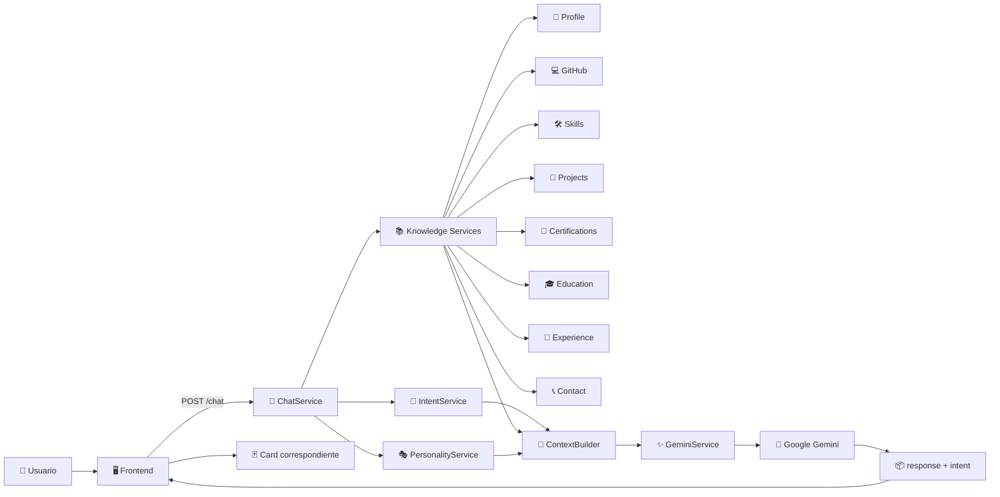
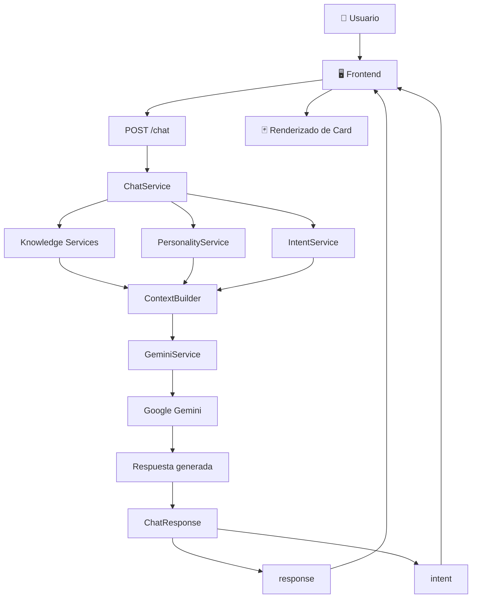
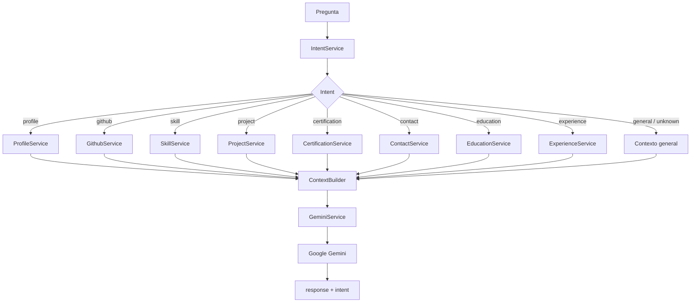

# 🤖 Portfolio IA API

<div align="center">

## 🚀 Backend de Inteligencia Artificial para Portafolio Personal

**FastAPI + Google Gemini + sistema de conocimiento JSON + detección de intenciones**


**API:** https://portafolio-ia-4r2q.onrender.com/  
**Swagger:** https://portafolio-ia-4r2q.onrender.com/docs  
**Repositorio:** https://github.com/Ezequie1Sc/Portafolio-IA

</div>

---

# 🖼️ Portada / Arquitectura

> Este README es **autocontenido**: la portada visual y los diagramas están escritos directamente en Markdown mediante Mermaid, por lo que no necesitas subir una imagen adicional al repositorio.



---

# 📌 ¿Qué es este proyecto?

**Portfolio IA API** es el backend de un portafolio personal interactivo que incorpora un asistente de inteligencia artificial.

La API fue construida con **FastAPI** y utiliza **Google Gemini** para generar respuestas contextualizadas sobre la información profesional del propietario del portafolio.

El sistema no depende únicamente de una conversación libre con el modelo. Antes de generar una respuesta:

1. Detecta qué está preguntando el usuario.
2. Identifica una **intención**.
3. Selecciona el servicio de conocimiento correspondiente.
4. Obtiene información estructurada desde archivos JSON.
5. Obtiene la personalidad y reglas del asistente.
6. Construye un contexto específico.
7. Envía ese contexto a Gemini.
8. Devuelve la respuesta junto con la intención detectada.
9. El frontend utiliza la intención para mostrar la **Card correspondiente**.

---

# ✨ Características principales

- 🤖 Integración con Google Gemini.
- 💬 Endpoint conversacional `/chat`.
- 🧠 Sistema de detección de intenciones.
- 📚 Sistema de conocimiento basado en JSON.
- 👤 Información profesional.
- 💻 Información de GitHub.
- 🛠️ Habilidades y tecnologías.
- 🚀 Sistema de búsqueda de proyectos.
- 📜 Sistema de certificaciones.
- 🎓 Educación.
- 💼 Experiencia.
- 📞 Contacto.
- 🎭 Personalidad configurable del asistente.
- 🧩 Construcción dinámica de contexto.
- 🃏 Integración con Cards del frontend.
- 🌐 CORS para comunicación con el frontend.
- 📖 Swagger UI y OpenAPI.
- ☁️ Despliegue en Render.

---

# 🧠 Arquitectura del sistema



---

# 🔄 Flujo de una consulta

Supongamos que el usuario pregunta:

```text
¿Cuáles son mis proyectos?
```

El flujo es:

```text
Usuario
   ↓
Frontend
   ↓
POST /chat
   ↓
ChatService
   ↓
IntentService
   ↓
project
   ↓
ProjectService
   ↓
data/projects/index.json
   ↓
Proyecto(s) correspondiente(s)
   ↓
ContextBuilder
   ↓
GeminiService
   ↓
Google Gemini
   ↓
response + intent
   ↓
Frontend
   ↓
ProjectCard
```

El backend devuelve una estructura similar a:

```json
{
  "response": "Estos son algunos de los proyectos desarrollados...",
  "intent": "project"
}
```

El frontend utiliza `intent` para determinar qué componente visual debe mostrar.

---

# 🎯 Sistema de intenciones

El backend utiliza `ChatIntent` para clasificar las consultas.

| Intent | Función |
|---|---|
| `general` | Conversación general |
| `profile` | Perfil profesional |
| `project` | Proyectos |
| `contact` | Contacto |
| `education` | Formación académica |
| `experience` | Experiencia profesional |
| `skill` | Habilidades y tecnologías |
| `certification` | Certificaciones |
| `github` | Perfil de GitHub |
| `unknown` | Intención no reconocida |

---

# 🃏 Integración con Cards

Una parte importante de la arquitectura es separar la **información** de su **representación visual**.

El backend devuelve:

```json
{
  "response": "🚀 Estas son las tecnologías y herramientas con las que trabajo actualmente.",
  "intent": "skill"
}
```

El frontend recibe `skill` y muestra:

```text
SkillsCard
```

La relación actual es:

| Intent | Card |
|---|---|
| `profile` | `ProfileCard` |
| `github` | `GithubCard` |
| `skill` | `SkillsCard` |
| `project` | `ProjectCard` |
| `certification` | `CertificationCard` |

Esto permite que Gemini no tenga que generar HTML ni conocer la interfaz visual.

El backend únicamente proporciona:

```text
respuesta + intención
```

y el frontend decide cómo representarla.

---

# 📚 Sistema de conocimiento

La información del portafolio se encuentra separada de la lógica de programación.

```text
data/
│
├── profile.json
├── github.json
├── skills.json
├── certifications.json
├── contact.json
├── education.json
├── experience.json
├── personality.json
├── metadata.json
│
└── projects/
    ├── index.json
    ├── skillmatch.json
    ├── portfolio-web.json
    ├── portfolio-demo.json
    ├── restaurant-website.json
    ├── climatizacion-web.json
    ├── atmosfera.json
    ├── celulas-plenum.json
    ├── kermes-rockera.json
    ├── javascript-laboratory.json
    ├── sigel-mobile.json
    ├── invernadero-mobile.json
    ├── barber-shop-mobile.json
    ├── videojuego.json
    ├── api-sigel.json
    ├── api-invernadero.json
    ├── api-barber.json
    ├── barberia-desktop.json
    ├── control-escolar.json
    └── inventario-desktop.json
```

Esto permite actualizar la información del portafolio sin tener que modificar el código principal.

---

# 🚀 ProjectService

Los proyectos cuentan con un índice:

```text
data/projects/index.json
```

Cada proyecto contiene información como:

```json
{
  "id": "skillmatch",
  "name": "SkillMatch",
  "file": "skillmatch.json",
  "category": "web",
  "featured": true,
  "keywords": [
    "skillmatch",
    "ia",
    "inteligencia artificial",
    "gemini",
    "react",
    "fastapi"
  ]
}
```

`ProjectService` realiza una búsqueda basada en puntuación.

Puede considerar:

- Nombre.
- ID.
- Categoría.
- Keywords.
- Proyectos destacados.
- Tipo de consulta.

### Consultas generales

Ejemplos:

```text
¿Cuáles son mis proyectos?
¿Qué proyectos has desarrollado?
¿Qué aplicaciones has hecho?
¿Qué trabajos has realizado?
```

Cuando la consulta es general, el servicio puede devolver los proyectos marcados como:

```json
"featured": true
```

### Consultas específicas

Ejemplos:

```text
Háblame de SkillMatch.
¿Qué proyectos tienes con React?
¿Qué proyectos tienes con Flutter?
Háblame del proyecto SIGEL.
```

El servicio busca coincidencias específicas y carga los archivos correspondientes.

---

# 📜 CertificationService

Las certificaciones se almacenan en:

```text
data/certifications.json
```

Cada certificación contiene información como:

```text
Nombre
Institución
Año
Categoría
Descripción
Topics
Skills
```

Esto permite realizar preguntas como:

```text
¿Qué certificaciones tienes?
¿Qué certificaciones tienes de Python?
¿Qué aprendiste en tus certificaciones?
¿Qué habilidades obtuviste?
¿Qué certificaciones tienes de Inteligencia Artificial?
```

El `CertificationService` se encarga de obtener la información de certificaciones disponible para el contexto de Gemini.

---

# 🤖 Integración con Google Gemini

La integración con Gemini está separada mediante:

```text
app/services/ai/gemini_service.py
```

El modelo no recibe únicamente la pregunta.

Primero se genera un contexto mediante `ContextBuilder`.

El contexto incluye:

```text
Identidad del asistente
Objetivo
Tono
Estilo
Longitud de respuesta
Reglas
Intención
Pregunta
Información disponible
```

Después:

```text
ContextBuilder
       ↓
GeminiService
       ↓
Google Gemini
       ↓
Respuesta
```

Esto permite controlar el comportamiento del asistente y reducir respuestas inventadas.

---

# 🧩 ChatService

`ChatService` es el orquestador principal.

Se encarga de coordinar:

```text
IntentService
ContextBuilder
GeminiService
ProfileService
ContactService
EducationService
ExperienceService
ProjectService
SkillService
CertificationService
PersonalityService
GithubService
```

Su flujo conceptual es:



---

# 📡 API

## 💬 `POST /chat`

Endpoint principal del asistente.

### Request

```json
{
  "message": "¿Qué certificaciones tienes?"
}
```

### Response

```json
{
  "response": "📜 Estas son algunas de las certificaciones disponibles...",
  "intent": "certification"
}
```

---

## 👤 `GET /knowledge/profile`

Obtiene la información del perfil.

---

## 🛠️ `GET /knowledge/skills`

Obtiene las habilidades y tecnologías.

---

## 💻 `GET /knowledge/github`

Obtiene la información de GitHub.

---

## 🏠 `GET /`

Endpoint principal.

Respuesta:

```json
{
  "message": "Portfolio IA API",
  "status": "running"
}
```

---

## ❤️ `GET /health`

Comprueba el estado del servidor.

---

## 🧪 `GET /test-gemini`

Prueba la conexión con Google Gemini.

---

## 📋 `GET /models`

Lista los modelos disponibles para la API configurada.

---

# 📖 Swagger / OpenAPI

FastAPI genera automáticamente la documentación de la API.

### Local

```text
http://localhost:8000/docs
```

### Producción

https://portafolio-ia-4r2q.onrender.com/docs

La documentación permite:

- Consultar endpoints.
- Ver schemas.
- Probar requests.
- Revisar responses.
- Explorar la especificación OpenAPI.

---

# 🏗️ Estructura del proyecto

```text
app/
│
├── api/
│   ├── __init__.py
│   ├── chat.py
│   └── knowledge.py
│
├── core/
│   ├── config.py
│   └── security.py
│
├── data/
│   ├── projects/
│   ├── certifications.json
│   ├── contact.json
│   ├── education.json
│   ├── experience.json
│   ├── github.json
│   ├── metadata.json
│   ├── personality.json
│   ├── profile.json
│   └── skills.json
│
├── models/
│   └── chat_intent.py
│
├── prompts/
│   └── ...
│
├── schemas/
│   └── chat.py
│
├── services/
│   ├── ai/
│   │   ├── context_builder.py
│   │   └── gemini_service.py
│   │
│   ├── chat/
│   │   └── chat_service.py
│   │
│   ├── intent/
│   │   └── intent_service.py
│   │
│   └── knowledge/
│       ├── profile_service.py
│       ├── contact_service.py
│       ├── education_service.py
│       ├── experience_service.py
│       ├── project_service.py
│       ├── skill_service.py
│       ├── certification_service.py
│       ├── personality_service.py
│       └── github_service.py
│
├── utils/
│   └── ...
│
└── main.py
```

---

# ⚙️ Variables de entorno

El proyecto utiliza variables de entorno para proteger la configuración sensible.

Ejemplo:

```env
GEMINI_API_KEY=tu_api_key
APP_NAME=Portfolio IA API
API_VERSION=1.0.0
```

⚠️ **Nunca subir `.env` a GitHub.**

Agregar:

```gitignore
.env
.venv/
__pycache__/
*.pyc
```

En Render, las variables se configuran directamente en:

```text
Dashboard
→ Service
→ Environment
→ Environment Variables
```

---

# 💻 Instalación local

## 1. Clonar

```bash
git clone https://github.com/Ezequie1Sc/Portafolio-IA.git
cd Portafolio-IA
```

## 2. Crear entorno virtual

### Windows

```bash
python -m venv .venv
.venv\Scripts\activate
```

### Linux / macOS

```bash
python -m venv .venv
source .venv/bin/activate
```

## 3. Instalar dependencias

```bash
pip install -r requirements.txt
```

## 4. Configurar `.env`

```env
GEMINI_API_KEY=tu_api_key
APP_NAME=Portfolio IA API
API_VERSION=1.0.0
```

## 5. Ejecutar

```bash
uvicorn app.main:app --reload
```

Servidor:

```text
http://localhost:8000
```

Swagger:

```text
http://localhost:8000/docs
```

---

# ☁️ Deploy en Render

El backend está preparado para ejecutarse como **Web Service**.

### Build Command

```bash
pip install -r requirements.txt
```

### Start Command

```bash
uvicorn app.main:app --host 0.0.0.0 --port $PORT
```

Render proporciona automáticamente:

```text
$PORT
```

La API desplegada está disponible en:

https://portafolio-ia-4r2q.onrender.com/

---

# 🌐 CORS

La configuración se encuentra en:

```text
app/core/security.py
```

Permite que el frontend desplegado pueda comunicarse con la API.

Para producción se recomienda configurar únicamente los dominios reales del frontend en lugar de mantener:

```python
allow_origins=["*"]
```

cuando no sea necesario.

---

# 🛠️ Tecnologías

| Tecnología | Utilización |
|---|---|
| 🐍 Python | Lenguaje principal |
| ⚡ FastAPI | Framework backend |
| 🤖 Google Gemini | Generación de respuestas |
| 🔷 Google GenAI | SDK para Gemini |
| 📦 Pydantic | Schemas y validación |
| ⚙️ Pydantic Settings | Configuración |
| 🚀 Uvicorn | Servidor ASGI |
| 📄 JSON | Sistema de conocimiento |
| 📖 OpenAPI | Documentación |
| 🧪 Swagger UI | Pruebas de API |
| ☁️ Render | Despliegue |

---

# 🔒 Consideraciones de seguridad

- Las API Keys se manejan mediante variables de entorno.
- `.env` no debe formar parte del repositorio.
- CORS debe limitarse a los dominios necesarios.
- La información del portafolio se mantiene separada de la lógica.
- Gemini recibe contexto controlado por el backend.
- El sistema indica al modelo que no invente información cuando los datos no están disponibles.

---

# 📈 Estado del proyecto

### Backend

- [x] FastAPI
- [x] API `/chat`
- [x] Detección de intents
- [x] ChatService
- [x] ContextBuilder
- [x] GeminiService
- [x] Sistema de conocimiento
- [x] Perfil
- [x] GitHub
- [x] Skills
- [x] Projects
- [x] Certifications
- [x] Education
- [x] Experience
- [x] Contact
- [x] Personality
- [x] Cards mediante `intent`
- [x] Swagger
- [x] OpenAPI
- [x] CORS
- [x] Deploy en Render

### Próximas mejoras

- [ ] Streaming de respuestas.
- [ ] Historial persistente.
- [ ] Tests automatizados.
- [ ] Mejoras en detección de intenciones.
- [ ] Observabilidad y logging.
- [ ] Optimización del sistema de conocimiento.

---

# 🔗 Enlaces

| Recurso | Enlace |
|---|---|
| 🌐 API | https://portafolio-ia-4r2q.onrender.com/ |
| 📖 Swagger | https://portafolio-ia-4r2q.onrender.com/docs |
| 💻 GitHub | https://github.com/Ezequie1Sc/Portafolio-IA |

---

# 👨‍💻 Autor

## Ezequiel Salazar

**Desarrollador Full Stack**

Proyecto desarrollado como parte de mi portafolio profesional para demostrar integración entre:

```text
Frontend
   +
FastAPI
   +
Google Gemini
   +
Sistema de conocimiento
   +
Detección de intenciones
   +
Componentes visuales dinámicos
```

---

<div align="center">

### ⭐ Portfolio IA API

**Un portafolio que no solamente muestra proyectos: también puede hablar sobre ellos.**

Desarrollado con ❤️ usando **Python + FastAPI + Google Gemini**

</div>
